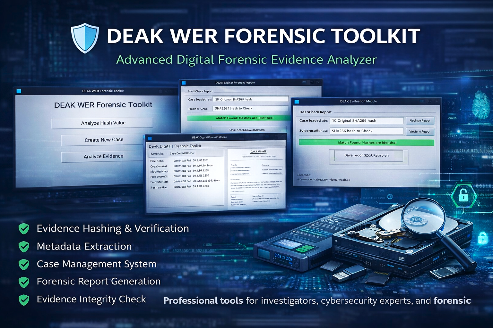

# 🛡️ DEAK WER Forensic Toolkit

<p align="center">
Digital Evidence Analysis Tool built in Python  
</p>

---

## 🔎 About The Project

**DEAK WER Forensic Toolkit** is a Digital Forensic Investigation Toolkit  
designed for evidence analysis, hash verification, metadata extraction  
and forensic report generation.

Developed by **Rohit Dubey**

---

## ⚙️ Core Features

- 📁 Case Management System  
- 🔐 Evidence Hashing (MD5 / SHA1 / SHA256)  
- 🧾 Metadata Extraction  
- ✅ Evidence Integrity Verification  
- 📊 Forensic Report Generation  
- 🖥️ Simple GUI Interface for Investigators  

---

## 🖥️ Tool Interface Preview

### 🔹 Main Dashboard

<p align="center">

</p>

---

### 🔹 Hash Analyzer Module

<p align="center">

</p>

---

## 🚀 Installation Guide

```bash
git clone https://github.com/masterandromeda/DEAK-WER-Forensic-Toolkit.git
cd DEAK-WER-Forensic-Toolkit
pip3 install -r requirements.txt
python3 gui.py


